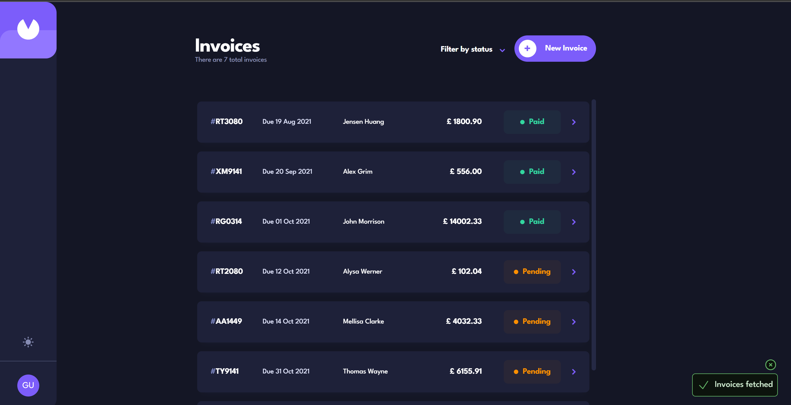
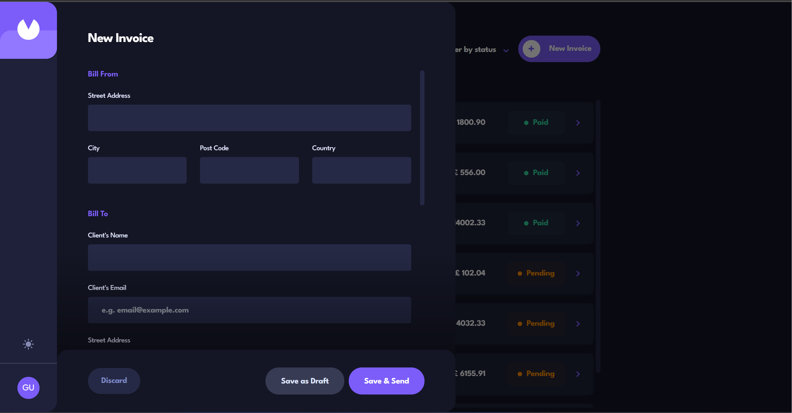
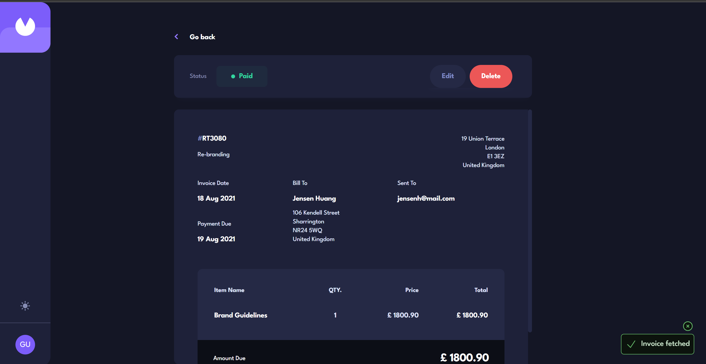

# Frontend Mentor - Invoice app solution

This is a solution to the [Invoice app challenge on Frontend Mentor](https://www.frontendmentor.io/challenges/invoice-app-i7KaLTQjl). Frontend Mentor challenges help you improve your coding skills by building realistic projects. 

## Table of contents

- [Overview](#overview)
  - [The challenge](#the-challenge)
  - [Solution screenshots](#solution-screenshots)
  - [Links](#links)
- [My process](#my-process)
  - [Built with](#built-with)
  - [Continued development](#continued-development)
  - [Possible project improvements](#possible-project-improvements)
  - [Useful resources](#useful-resources)

## Overview

### The challenge

Users should be able to:

- View the optimal layout for the app depending on their device's screen size
- See hover states for all interactive elements on the page
- Create, read, update, and delete invoices
- Receive form validations when trying to create/edit an invoice
- Save draft invoices, and mark pending invoices as paid
- Filter invoices by status (draft/pending/paid)
- Toggle light and dark mode
- Keep track of any changes, even after refreshing the browser

### Solution screenshots

### Links

- Frontend code: [frontend github repository](https://github.com/EltonLobo07/invoice-app-frontend)
- Backend code: [backend github repository](https://github.com/EltonLobo07/invoice-app-backend)
- Live Site URL: [live site](https://tan-rich-crow.cyclic.cloud/)

## My process

### Built with

- HTML, CSS, JavaScript
- [TypeScript](https://www.typescriptlang.org/) - Programming language
- [React](https://react.dev/) - JS UI library
- [TailwindCSS](https://tailwindcss.com/) - CSS library
- [PostgreSQL](https://www.postgresql.org/) - Relational database
- [Express](https://expressjs.com/) - Backend web framework
- [PgTyped](https://pgtyped.dev/) - Typesafe SQL in TypeScript helper
- [Zod](https://zod.dev/) - Schema validation library

### Continued development

While developing the project I had to decide if I should use an ORM or write raw SQL queries. I decided to write out SQL queries since I wanted to practice writing queries. In the process, I realized ORMs can help me a ton by providing the necessary tools to use a database from a web server out of the box. I will try to use an ORM for any future full stack projects and then decide what's easy and fun to work with.  

### Possible project improvements

- Building a paginated view of the invoice list. At most X invoices remain in the internal invoice list. Scrolling to the top-most or bottom-most point of the invoice list container sends a request to the backend requesting the next or previous batch of invoices   
- Filtering or ordering invoices based on a particular field's value (Examples: a button when clicked, displays invoices in descending order of the "paymentDue" value of each invoice from the database, filtering the invoices by case insensitive substring match of the "clientName" field's value and so on)
- Make transitions look natural for most of the elements that are shown based on some action performed by a user and later kept hidden (Example: Showing and hiding the invoice form modal can be a bit gradual by playing with mainly opacity + transition CSS properties)

### Useful resources

I can't think of any particular resource that helped me signficantly while working of this project but I would definitely recommend [The Odin Project](https://www.theodinproject.com/) for anyone starting with web development
